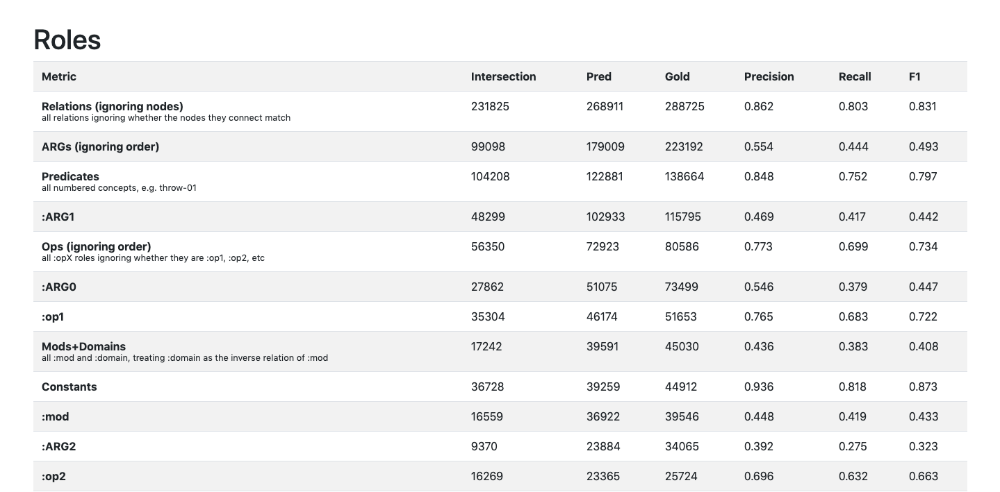

# amr-evaluation-extended

An extension to [mdtux89/amr-evaluation](https://github.com/mdtux89/amr-evaluation) (Marco Damonte's AMR evaluation tool). Features, in addition to the original tool, include:

* Performance for individual roles and concepts.
* Evaluation of AMRs with alignments.
  * Performance for predictions over each part of speech and dependency relation defined by [Universal Dependencies](https://universaldependencies.org/).
* Pretty HTML output using [Jinja](https://jinja.palletsprojects.com/en/2.11.x/) and [Bootstrap](https://getbootstrap.com/).



## Usage

Ensure that you're using Python 3.

```bash
pip install -r requirements.txt
python scores.py [predicted] [gold] [gold-with-alignments]
```

When no args are passed, the following files are used:
* Predicted: `train_pred/unaligned/train_pred.txt`
* Gold: `train_pred/unaligned/train_gold.txt`
* Gold with alignments: `train_pred/aligned/train.aligned.txt`

The output is sent to `out.html` and `out2.html`, which can be opened in your favourite browser as well as copied into a spreadsheet.
